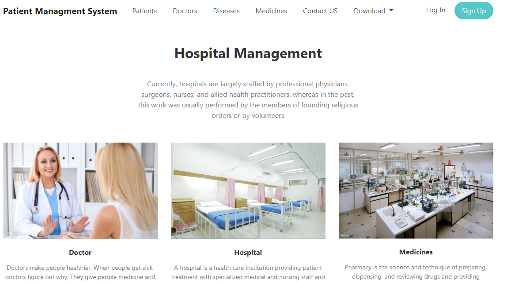
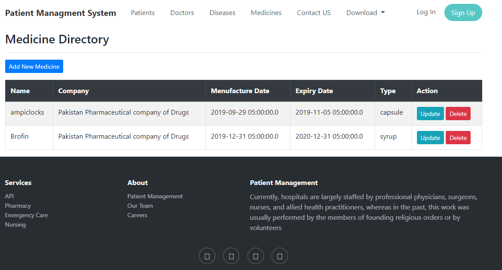
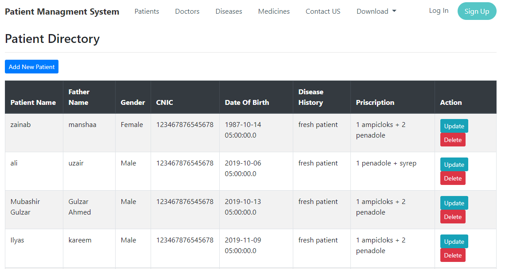
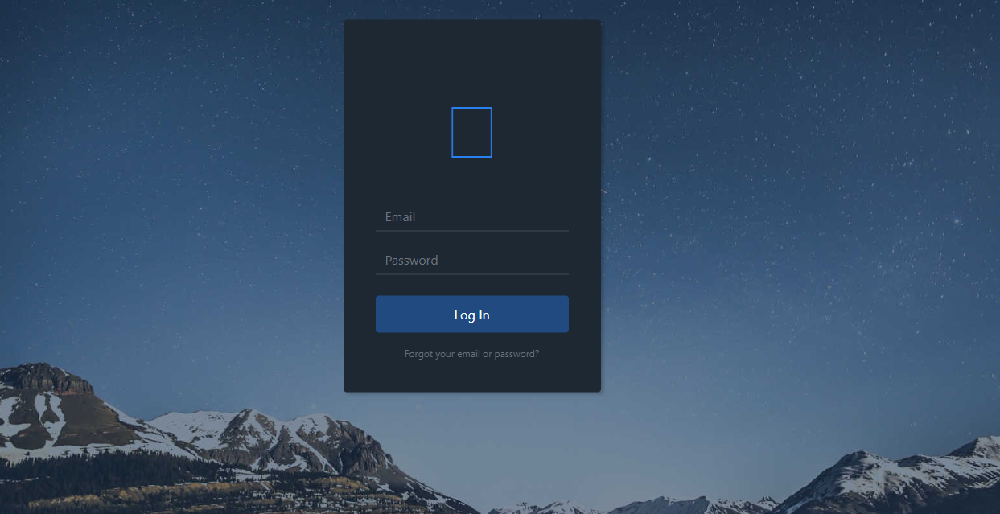

# Hospital Managment Application.

<h3>Frontend Work</h3>
Tools and technologies <br/>
•	HTML, CSS, Bootstrat and Spring thmeleafe used for front-end.<br/>
•	Postgress database and Spring Boot and Hibernate used for backed work. </br><br/>
Features in our Application.<br/>

. Manage Records (CRUD)<br/>
   • Manage Doctor, patient, disease, medicine records .<br/>


<h3> Run With :</h3>
````
mvn clean install  

mvn spring-boot:run

````

<h3>Screenshots</h3>

<p>Home.</p><br>

<hr>
<p>Medicine Directory.</p><br>

<hr>
<p>Patient Diarctory</p><br>

<hr>
<p>Login</p><br>

<hr>
